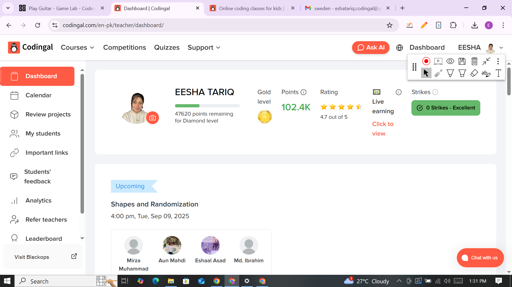
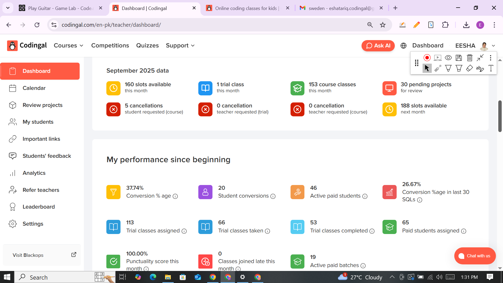
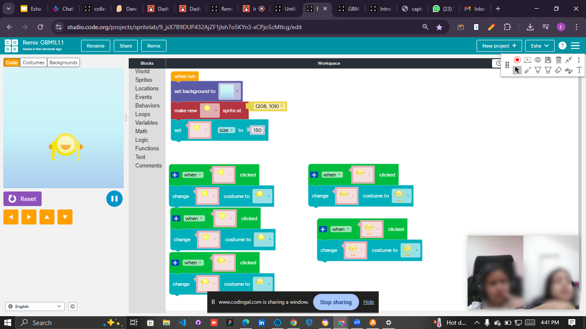
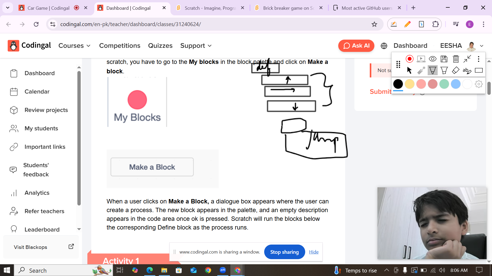
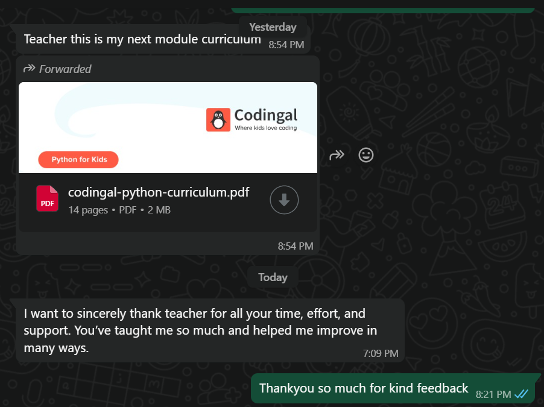

# 👩‍🏫 Eesha Tariq — Global Python, Data Structures & AI Instructor @ Codingal (YC W21)

Welcome to my **Codingal Teaching Portfolio** — I'm Eesha Tariq, a passionate Tech Trainer and Software Engineer selected as a **Global Instructor at [Codingal](https://www.codingal.com)**, a Y Combinator-funded EdTech platform (YC W21).  
I specialize in teaching **Python, Data Structures, Data Science, and Artificial Intelligence** to K–12 students worldwide.  

---

### 🚀 Milestone: Global Tech Educator – Codingal YC21

- 🧠 Delivered **~950 hours** of live instruction in **Python, Data Structures, AI, and Data Science** (June–December 2025).  
- 🌍 Mentored **250+ international K–12 students** from diverse countries:  
  🇺🇸 United States 🇨🇦 Canada 🇦🇺 Australia 🇦🇪 UAE 🇶🇦 Qatar 🇬🇧 United Kingdom 🇮🇳 India 🇸🇦 Saudi Arabia 🇮🇩 Indonesia 🇲🇺 Mauritius 🇲🇦 Morocco 🇸🇪 Sweden 🇱🇰 Sri Lanka  
- 🎯 Designed and delivered **project-based, interactive lessons** that simplify complex STEM topics.  
- 🌟 Achieved a **4.7/5 student satisfaction rating**, reflecting strong student and parent feedback.  
- 🏆 Built an inclusive learning environment fostering **critical thinking, creativity, and coding excellence**.  

---

## 📅 Monthly Teaching Structure (June–December 2025)

| Month      | Hours Taught | No. of Live Classes | Notes                                |
|------------|--------------|-------------------|--------------------------------------|
| June       | 142 hrs      | —                 | Python, Basics + Projects             |
| July       | 135 hrs      | —                 | Data Structures Foundations           |
| August     | 144 hrs      | —                 | Python OOP + DS Improvement           |
| September  | 143 hrs      | —                 | AI Basics + ML Mini Projects          |
| October    | 135 hrs      | —                 | Web + Python + Logic Building         |
| November   | 98 hrs       | —                 | Reduced due to schedule shifts        |
| December   | 100 hrs      | —                 | Wrap-up & Student Projects            |
| **Makeup Classes** | **50 hrs** | —           | Extra/rescheduled sessions            |
| **Total**  | **~950 hrs** | **400+ classes**  | Overall Instruction Delivered         |

---

## 🧠 Subjects & Skills Taught

### 🐍 Python Programming & Core CS
- Syntax, Variables, Input/Output  
- Control Flow: If-Else, Nested Conditions  
- Loops: For Loops, While Loops, Break & Continue  
- Functions: Parameters, Return Values, Recursion  
- Modules & Packages (`math`, `random`, Custom Modules)  
- Object-Oriented Programming (Classes, Inheritance, Polymorphism)  

### 🧩 Data Structures & Algorithms
- Lists, Tuples, Dictionaries  
- Stacks, Queues, Linked Lists  
- Problem-Solving & Algorithmic Thinking  
- Complexity Basics & Recursion  
- Algorithm Design for Real-World Applications  

### 📊 Data Science & AI Implementation
- Data Handling, Cleaning, and Preprocessing in Python  
- Exploratory Data Analysis & Visualization  
- **Advanced Machine Learning**: Supervised & Unsupervised Learning  
- **Deep Learning Models**: CNNs, ANN, RNNs  
- **Recommendation Systems**: Collaborative & Content-Based Filtering  
- **Model Deployment & End-to-End AI Projects**  
- Hands-on reasoning, feature engineering, model evaluation, and real-world project solutions  

### 🤖 AI Foundations & Artificial Intelligence Specialization
- Fundamentals of AI and reasoning  
- Problem-solving with AI algorithms  
- Neural Networks, Deep Learning, and AI model design  
- Practical AI projects demonstrating **advanced decision-making and reasoning**  

### 🌐 Web Development
- HTML, CSS, JavaScript fundamentals  
- Front-End Frameworks and Responsive Design  
- Back-End Integration with Python (Flask/FastAPI)  
- Database Handling & API Development  
- Full-Stack Project Implementation: From concept to deployment  

---

## ✨ Highlights

- ✅ Selected as a **Global Instructor** at **Codingal (YC W21)**.  
- ⭐ Delivered **~950 hours of coding education** with a **4.7/5 teaching rating**.  
- 👩‍🏫 Taught **Python, Data Structures, and Data Science/AI basics** to global K–12 learners.  
- 🎓 Helped students develop strong **computational thinking and analytical skills**.  

---

## 🌱 Teaching Takeaways & Growth

Through this journey, I gained invaluable personal and professional growth:  

- 🕰️ **Patience & Practice** — developed patience by teaching students at all levels, from complete beginners to advanced learners.  
- 📚 **Student-Centered Approach** — prepared students step by step from the basics, ensuring solid foundations before moving to complex topics.  
- 🌍 **Cultural Exposure** — taught international students and often discussed their school life, gaining rich cultural and educational perspectives.  
- 🌈 **Diversity & Inclusion** — learned to adapt teaching for a wide range of learners, improving my flexibility in problem-solving.  
- 🔄 **Consistency** — strengthened my discipline by delivering hours of live teaching daily, improving reliability and clarity in knowledge transfer.  

---

# 🖼️ Teaching Portfolio Highlights

### 📊 Teaching Dashboard

### 📈 Teacher Performance Overview

### 🌍 International Students – UAE Spotlight

### 🌍 International Students – United Kingdom Spotlight

### 🌍 International Students – Australia Spotlight

### 🌍 International Students – Qatar Spotlight

### 🌍 International Students – Sweden Spotlight

### 💬 Student Feedback

---

## 🔗 Connect with Me

- 💼 [LinkedIn – @esha-tariqdev](https://www.linkedin.com/in/esha-tariqdev/)  
- 💻 [GitHub – codewithEshaYoutube](https://github.com/codewithEshaYoutube)  
- 📧 Email: **eshatariq.codingal@gmail.com**

---

> _“Empowering the next generation of coders through Python, Data Science, and AI.”_ 💡
