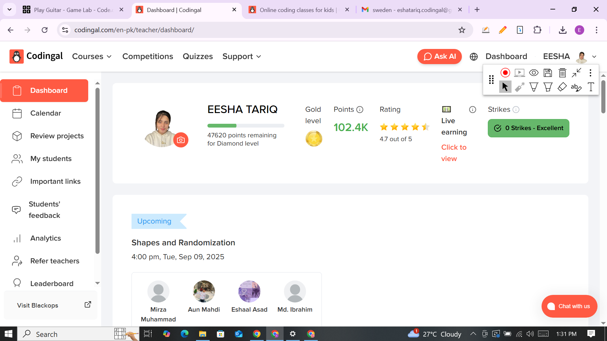
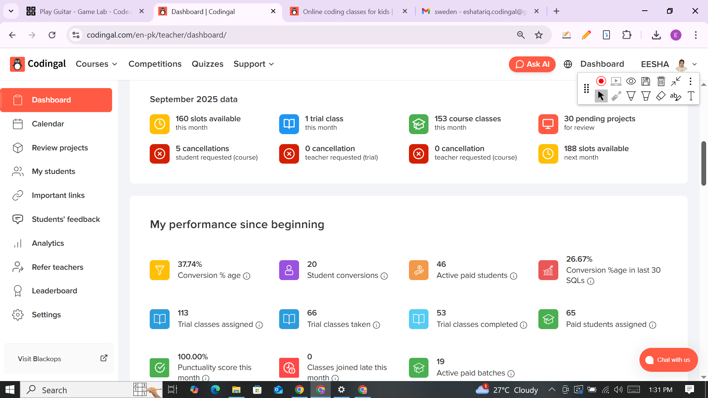
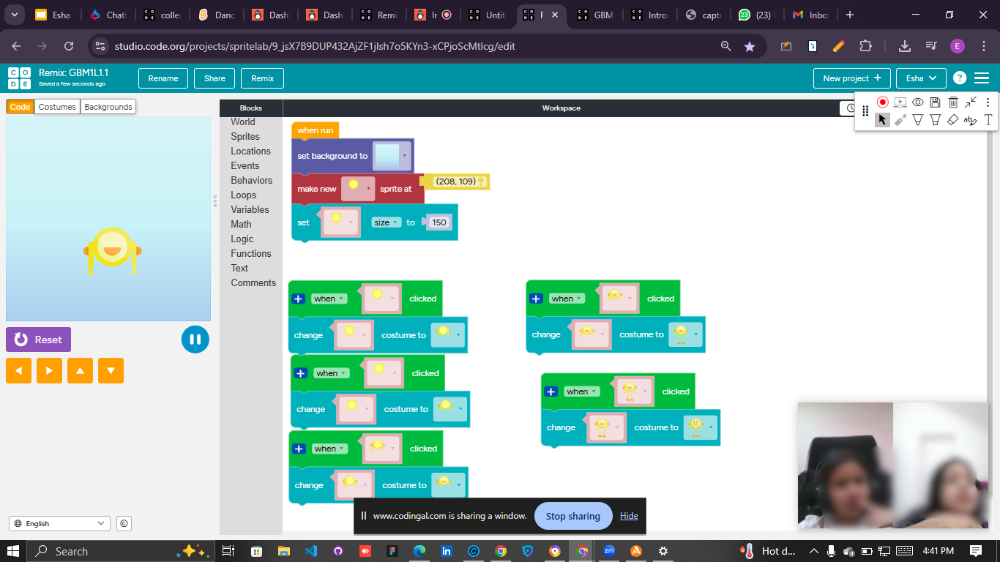
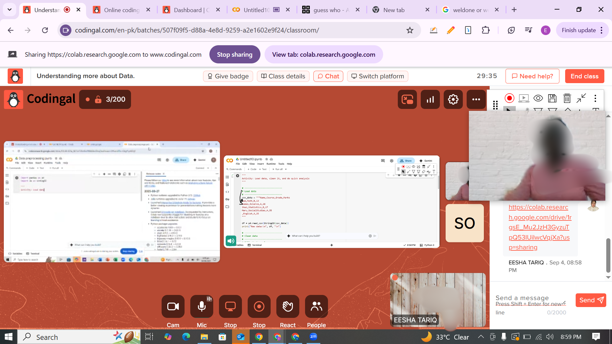
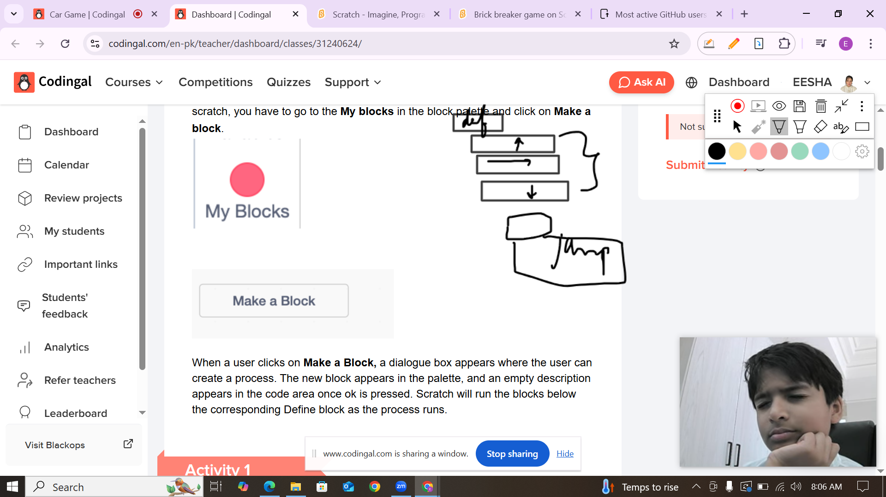
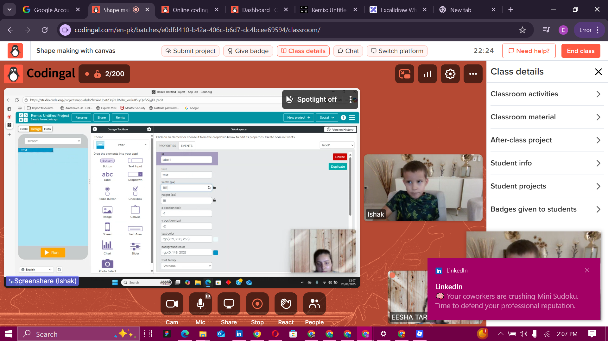
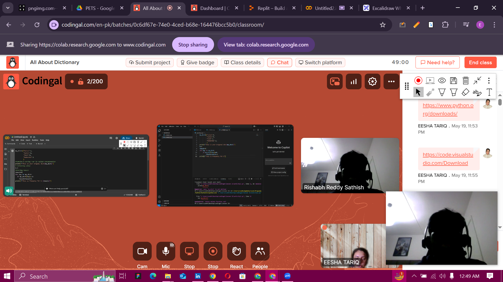
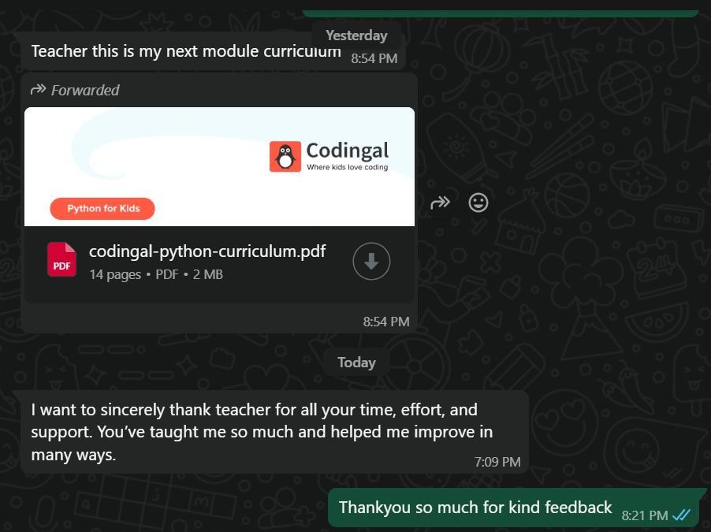

# 👩‍🏫 Eesha Tariq — Global Python, Data Structures & AI Instructor @ Codingal (YC W21)

Welcome to my **Codingal Teaching Portfolio** — I'm Eesha Tariq, a passionate Tech Trainer and Software Engineer selected as a **Global Instructor at [Codingal](https://www.codingal.com)**, a Y Combinator-funded EdTech platform (YC W21).  
I specialize in teaching **Python, Data Structures, Data Science, and Artificial Intelligence** to K–12 students worldwide.  

---

### 🚀 Milestone: Global Tech Educator – Codingal YC21

- 🧠 Delivered **~1200 hours** of live instruction in **Python, Data Structures, AI, and Data Science** (June–December 2025).  
- 🌍 Mentored **250+ international K–12 students** from diverse countries:  
  🇺🇸 United States 🇨🇦 Canada 🇦🇺 Australia 🇦🇪 UAE 🇶🇦 Qatar 🇬🇧 United Kingdom 🇮🇳 India 🇸🇦 Saudi Arabia 🇮🇩 Indonesia 🇲🇺 Mauritius 🇲🇦 Morocco 🇸🇪 Sweden 🇱🇰 Sri Lanka  
- 🎯 Designed and delivered **project-based, interactive lessons** that simplify complex STEM topics.  
- 🌟 Achieved a **4.7/5 student satisfaction rating**, reflecting strong student and parent feedback.  
- 🏆 Built an inclusive learning environment fostering **critical thinking, creativity, and coding excellence**.  

---

## 📅 Monthly Teaching Structure (June–December 2025)
| Month               | Hours Taught | No. of Live Classes | Notes                                      |
|--------------------|-------------|--------------------|--------------------------------------------|
| June               | 142 hrs     | —                  | Python, Basics + Projects                  |
| July               | 135 hrs     | —                  | Data Structures Foundations                |
| August             | 144 hrs     | —                  | Python OOP + DS Improvement                |
| September          | 143 hrs     | —                  | AI Basics + ML Mini Projects               |
| October            | 135 hrs     | —                  | Web + Python + Logic Building              |
| November           | 98 hrs      | —                  | Reduced due to schedule shifts             |
| December           | 100 hrs     | —                  | Wrap-up & Student Projects                 |
| January            | 80 hrs      | —                  | Java + Android Development                 |
| February           | 82 hrs      | —                  | Java + Android Development                 |
| **Makeup Classes** | **50 hrs**  | —                  | Extra/rescheduled sessions                 |
| **Total**          | **~1,187 hrs** | **600+ classes** | **500+ students trained**                  |

# 🌐 International Teaching Recordings

This repository showcases my **international teaching portfolio** in advanced programming, AI, Data Science, and Game Development. It reflects my ability to teach complex technical concepts to a **global audience**, blending theoretical understanding with **hands-on project-based learning**.

---

## 📊 Key Achievements

- Delivered **900+ hours of teaching** to **255+ international students** across multiple continents.  
- Taught learners from **diverse cultures and countries**, strengthening cultural adaptability and global teaching effectiveness.  
- Developed strong **patience and rapport** while managing student learning needs and engaging effectively with parents.  
- Improved **communication skills** through consistent interaction with global families and multicultural classrooms.  
- Expertise in **Advanced Data Science & AI**, including **Deep Learning, CNNs, ANNs, NLP, and Recommendation Systems**.  
- Conducted specialized courses in **Python for AI**, **Object-Oriented Programming**, and **Game Development**.  
- Impact across **Europe, Asia, the Middle East, Africa, and Oceania**.  
- Designed **practical, project-based learning experiences** to build **industry-ready skills** in students.  

## 📚 Recordings by Country & Topic

| Country       | Recording Link | Instructor | Topic |
|---------------|----------------|------------|-------|
| Sweden        | [OOP-Python](https://drive.google.com/file/d/1a0sqtZWAZVwqODbdU5CIp4BK3T3f5gv7/view?usp=sharing) | Eesha Tariq | Object-Oriented Programming & Python |
| United Kingdom| [Data Science](https://drive.google.com/file/d/1rYYCb2wCP0KZq_Xpx2dGGT35WaMVAfIq/view?usp=sharing) | Eesha Tariq | Data Science Concepts & NLP Implementation |
| Australia     | [AI Applications](https://drive.google.com/file/d/15LHp0cpUx9XpQZQ4ldw9M6aul8jfyiu3/view?usp=sharing) | Eesha Tariq | Advanced AI Applications |
| Australia     | [Advanced Python Game Building](https://drive.google.com/file/d/12-Y1ot_gEALG-mcO_KpgiG_ljfs5_XUm/view?usp=sharing) | Eesha Tariq | Game Development & Python |
| Oman & Qatar  | [Game Development](https://drive.google.com/file/d/1xVNZVFF-YVdtDMEgT2ADVAJf76rz9iPi/view?usp=sharing) | Eesha Tariq | Full-Stack Game Development |
| Dubai, India & Nigeria | [Digit Recognizer CNN AI](https://drive.google.com/file/d/1GJWdWF42oIHtMI7wos-WFy3kkOlDjV0A/view?usp=sharing) | Eesha Tariq | CNN for Digit Recognition |
| United Kingdom| [Image Classifier CNN AI](https://drive.google.com/file/d/1b_40f83MUSnkTqvSeIYeTQl-FsBRaRy7/view?usp=sharing) | Eesha Tariq | Image Classification using CNN |
| Pakistan      | [Interlinking in Coding](https://drive.google.com/file/d/1r1pbTazSRGEURx3x43yAAe9-TPVGnJF4/view?usp=sharing) | Eesha Tariq | Advanced Coding Techniques |
| United Kingdom| [Recommendation Engine Algorithm](https://drive.google.com/file/d/1XlbUEmfi_5z2Mjg_unPeL4KV6l-JkIG/view?usp=sharing) | Eesha Tariq | Recommendation Systems with Python |
| United Kingdom| [ANN Implementation in Keras](https://drive.google.com/file/d/1RD0NeMPLggpNTXft1tsBFmYmM5LQc1fv/view?usp=sharing) | Eesha Tariq | Artificial Neural Networks in Keras |
| Australia     | [Paint Game Coding](https://drive.google.com/file/d/18R08PnFKcW24uHRv6yCG9PUqrpfJk7l8/view?usp=sharing) | Eesha Tariq | Python-based Paint Game Development |
| Australia     | [Pose detection AI_Dog_Trainer](https://drive.google.com/file/d/18bEH7WZY_y0bu9i7YTQwALih6t3BJC8C/view?usp=sharing) | Eesha Tariq | AI Teachable Machine Pose detection |
| UAE           | [Application Programming Interface](https://drive.google.com/file/d/1VVadKtBMYr7yIEuDOJdrKCh27H1iiS5G/view?usp=sharing) | Eesha Tariq | Application Programming Interface Concepts |
| Qatar         | [Survey Restaurant App](https://drive.google.com/file/d/1hfoKn06DtGyU65aMWBwYn8_HjQBrEqjT/view?usp=sharing) | Eesha Tariq | Survey App Development for Restaurants |
| Australia     | [Machine Learning Project](https://drive.google.com/file/d/1l058ibFLp9cIXytRhRmlA-USAVMOKwg4/view?usp=sharing) | Eesha Tariq | Machine Learning Project Implementation |
| United Kingdom| [Java Basics & Project](https://drive.google.com/file/d/1_cHLs-sr4evHezzxxuet6_ybXgxwNlFU/view?usp=sharing) | Eesha Tariq | Java Fundamentals & Project Work |
| United Kingdom| [Operators and Methods in Java](https://drive.google.com/file/d/1UCm4cvB1asI_bTfyEaz0UMHOVUAvULyD/view?usp=sharing) | Eesha Tariq | Type of Operators , Logical Understanding |
| Pakis| [Java Basics & Project](https://drive.google.com/file/d/1_cHLs-sr4evHezzxxuet6_ybXgxwNlFU/view?usp=sharing) | Eesha Tariq | Java Fundamentals & Project Work |
| United Kingdom| [Operators and Methods in Java](https://drive.google.com/file/d/1UCm4cvB1asI_bTfyEaz0UMHOVUAvULyD/view?usp=sharing) | Eesha Tariq | Type of Operators , Logical Understanding |
| United Kingdom| [Polymorphism in Java](https://drive.google.com/file/d/1roYSM_tVzBH0TDns-SVYyKCUzmAgKDig/view?usp=sharing) | Eesha Tariq | getter and setter functions |
| United Kingdom| [Access Modifiers, Overriding, Overloading](https://drive.google.com/file/d/1jcliFDrmxdWesP3HyVXqn-R1dnmdHZ13/view?usp=sharing) | Eesha Tariq | In Depth Concepts |
| Oman           | [Sign Language App](https://drive.google.com/file/d/1UGyDSKdMcd3M7s-4Usxgl0JTh19mIF8J/view?usp=sharing) | Eesha Tariq   | Sign Language Learning & Communication Application |

---

## 🌟 Highlights of Advanced Courses

1. **Advanced Data Science & AI Implementation Course**  
   - Deep Learning, Neural Networks, CNNs, RNNs, and AI-based Project Implementation.  

2. **Python for AI Course**  
   - Comprehensive Python programming for AI projects, including ML libraries, data processing, and AI workflows.  

3. **Game Development & Advanced Python Programming**  
   - Designing interactive games with **OOP**, event-driven programming, and GUI-based applications.  

4. **Practical, Hands-On Projects**  
   - Every course includes **real-world projects** to ensure students gain **industry-ready skills**.  

---

## 🎯 Purpose

These recordings demonstrate my **international teaching expertise**, **proficiency in advanced AI and Data Science**, and ability to **deliver complex technical concepts** to students from diverse backgrounds. They reflect my **dedication to global education, research-driven teaching, and preparing students for real-world applications**.

---

*Prepared by Eesha Tariq — International Tech Educator, AI Researcher & Curriculum Developer*

## 🧠 Subjects & Skills Taught

### 🐍 Python Programming & Core CS
- Syntax, Variables, Input/Output  
- Control Flow: If-Else, Nested Conditions  
- Loops: For Loops, While Loops, Break & Continue  
- Functions: Parameters, Return Values, Recursion  
- Modules & Packages (`math`, `random`, Custom Modules)  
- Object-Oriented Programming (Classes, Inheritance, Polymorphism)  

### 🧩 Data Structures & Algorithms
- Lists, Tuples, Dictionaries  
- Stacks, Queues, Linked Lists  
- Problem-Solving & Algorithmic Thinking  
- Complexity Basics & Recursion  
- Algorithm Design for Real-World Applications  

### 📊 Data Science & AI Implementation
- Data Handling, Cleaning, and Preprocessing in Python  
- Exploratory Data Analysis & Visualization  
- **Advanced Machine Learning**: Supervised & Unsupervised Learning  
- **Deep Learning Models**: CNNs, ANN, RNNs  
- **Recommendation Systems**: Collaborative & Content-Based Filtering  
- **Model Deployment & End-to-End AI Projects**  
- Hands-on reasoning, feature engineering, model evaluation, and real-world project solutions  

### 🤖 AI Foundations & Artificial Intelligence Specialization
- Fundamentals of AI and reasoning  
- Problem-solving with AI algorithms  
- Neural Networks, Deep Learning, and AI model design  
- Practical AI projects demonstrating **advanced decision-making and reasoning**  

### 🌐 Web Development
- HTML, CSS, JavaScript fundamentals  
- Front-End Frameworks and Responsive Design  
- Back-End Integration with Python (Flask/FastAPI)  
- Database Handling & API Development  
- Full-Stack Project Implementation: From concept to deployment  

---

## ✨ Highlights

- ✅ Selected as a **Global Instructor** at **Codingal (YC W21)**.  
- ⭐ Delivered **~950 hours of coding education** with a **4.7/5 teaching rating**.  
- 👩‍🏫 Taught **Python, Data Structures, and Data Science/AI basics** to global K–12 learners.  
- 🎓 Helped students develop strong **computational thinking and analytical skills**.  

---

## 🌱 Teaching Takeaways & Growth

Through this journey, I gained invaluable personal and professional growth:  

- 🕰️ **Patience & Practice** — developed patience by teaching students at all levels, from complete beginners to advanced learners.  
- 📚 **Student-Centered Approach** — prepared students step by step from the basics, ensuring solid foundations before moving to complex topics.  
- 🌍 **Cultural Exposure** — taught international students and often discussed their school life, gaining rich cultural and educational perspectives.  
- 🌈 **Diversity & Inclusion** — learned to adapt teaching for a wide range of learners, improving my flexibility in problem-solving.  
- 🔄 **Consistency** — strengthened my discipline by delivering hours of live teaching daily, improving reliability and clarity in knowledge transfer.  

---

# 🖼️ Teaching Portfolio Highlights

### 📊 Teaching Dashboard

### 📈 Teacher Performance Overview

### 🌍 International Students – UAE Spotlight

### 🌍 International Students – United Kingdom Spotlight

### 🌍 International Students – Australia Spotlight

### 🌍 International Students – Qatar Spotlight

### 🌍 International Students – Sweden Spotlight

### 💬 Student Feedback

---

## 🔗 Connect with Me

- 💼 [LinkedIn – @esha-tariqdev](https://www.linkedin.com/in/esha-tariqdev/)  
- 💻 [GitHub – codewithEshaYoutube](https://github.com/codewithEshaYoutube)  
- 📧 Email: **eshatariq.codingal@gmail.com**

---

> _“Empowering the next generation of coders through Python, Data Science, and AI.”_ 💡
