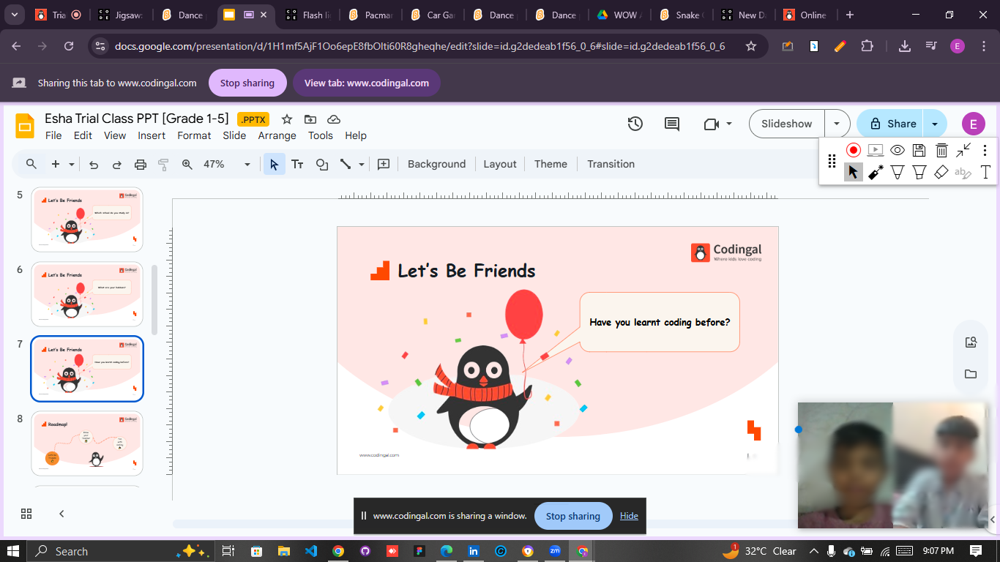

# 👩‍🏫 Eesha Tariq — Global Python & Logic Instructor @ Codingal (YC W21)

Welcome to my **Codingal Teaching Portfolio** — I'm Eesha Tariq, a passionate Tech Trainer and Software Engineer selected as a **Global Instructor at [Codingal](https://www.codingal.com)**, a Y Combinator-funded EdTech platform (YC W21). I teach **Python** and **Logic Building** to K–12 students from across the world.

---

## 🌍 Global Teaching Impact

- 👩‍💻 Taught **50+ international students** in a single month.
- 📊 **Student rating**: ⭐ **4.6/5** based on feedback and performance analytics.
- 🌐 Taught students from:
  - 🇺🇸 United States
  - 🇨🇦 Canada
  - 🇦🇺 Australia
  - 🇦🇪 UAE
  - 🇮🇳 India

---

## 🧠 Skills Taught

### 🐍 Python Programming

| Topic | Subtopics |
|-------|-----------|
| Basics | Syntax, Variables, Input/Output |
| Control Flow | If-Else, Nested Conditions |
| Loops | For Loops, While Loops, Break & Continue |
| Data Structures | Lists, Tuples, Dictionaries |
| Functions | Defining, Parameters, Return Values |
| Modules & Packages | `math`, `random`, Custom Modules |

### 🧩 Logic & Problem Solving

| Skill | Examples |
|-------|----------|
| Pattern Building | Stars, Numbers, Triangles |
| Math Logic | Prime, Even/Odd, Divisibility |
| Visual Logic | Maze solving, Path tracing |
| Pseudocode Writing | Flow control, Indentation |
| Game-based Challenges | Logic circuits, Code blocks |

---

## ✨ Highlights

- ✅ Selected as a **Python Instructor** on **Codingal (YC W21)**.
- ⭐ Maintained an average **4.6/5 student satisfaction rating**.
- 👩‍🏫 Delivered live, interactive coding classes using **DSA** and **Python** fundamentals.
- 🎓 Contributed to building foundational problem-solving skills in global K–12 learners.

---

## 🖼️ Teaching Snapshots

### 📌 Dashboard View

---

### 📌 Students' Performance Overview

---

### 📌 International Students – UAE Spotlight

---

### 📌 Feedback & Interaction

---

## 🔗 Connect with Me

- 💼 [LinkedIn – @esha-tariqdev](https://www.linkedin.com/in/esha-tariqdev/)
- 💻 [GitHub – codewithEshaYoutube](https://github.com/codewithEshaYoutube)
- 📧 Email: **eshatariq.codingal@gmail.com**

---

> _“Empowering the next generation of coders through logic, creativity, and code.”_ 💡
